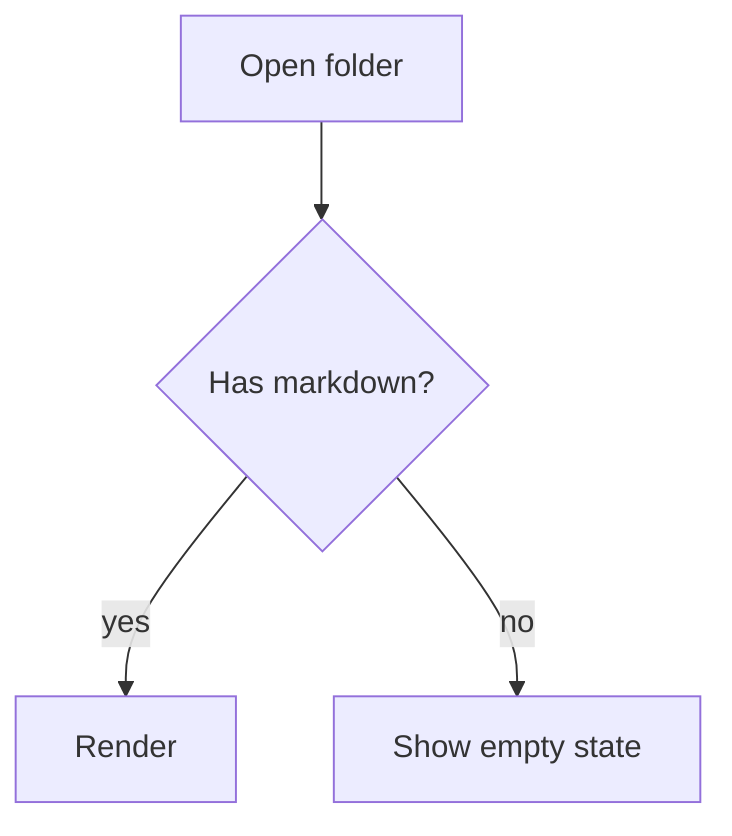

# Guide

## Install

```rust
fn main() {
    println!("Hello from Rust");
}
```

Back to [the README](../README.md).

## Diagram


```mermaid
graph TD
  A[Open folder] --> B{Has markdown?}
  B -- yes --> C[Render]
  B -- no --> D[Show empty state]
```
